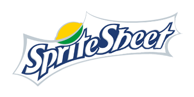

# 

[](https://bundlephobia.com/result?p=@pencil.js/spritesheet)

Pack a set of images into a single spritesheet along its json description file. ([CLI version](https://github.com/pencil-js/spritesheet-cli))

## Install

    npm install @pencil.js/spritesheet

## Usage

```js
import spritesheet from "@pencil.js/spritesheet";
import { writeFileSync } from "fs";

// List of files to pack
const files = ["image1.png", "image2.jpg", "image3.gif"];
const options = {
    outputFormat: "png",
};
// Call the async function and extract the json and image values
(async () => {
    const { json, image } = await spritesheet(files, options);
    // Write the files (for example)
    writeFileSync("spritesheet.png", image);
    writeFileSync("spritesheet.json", JSON.stringify(json));
})();
```

## Documentation

### `spritesheet(files, [options])`
The methods accept two arguments.

| Name | Type | Default | Comment |
| --- | --- | --- | --- |
|files |`Array<String>` |required |List of paths to the images |
|options |`Object` |(see below) |Some options |

##### `options`
You can specify some options on the second argument.

| Name | Type | Default | Comment |
| --- | --- | --- | --- |
|outputFormat |`String` |`"png"` |Format of the output image (`"png"` or `"jpeg"`) |
|outputName |`String` |`"spritesheet.png"` |Name of the image file (for reference in the JSON file) |
|margin |`Number` |`1` |Added pixels between sprites (can prevent pixels leaking to adjacent sprite) |
|crop |`Boolean` |`true` |Cut transparent pixels around sprites |

#### returns
`spritesheet` returns a `Promise` for an `Object` containing a `json` and `image` field.

| Name | Type | Comment |
| --- | --- | --- |
|json |`Object` |All data related to the spritesheet ([example](test/snapshots/index.js.md#main)) |
|image |`Buffer` |The result image as a buffer |

##### JSON
The returned JSON file is composed of two parts:
 - `meta` - Global data about the generated file
 - `frames` - Set of all frames/spites with path as key

Each frames gives data about itself:
 - `frame` - The `x`, `y` position on the whole image and `w`, `h` for the size
 - `rotated` - Tell is the sprite have been rotated (not yet supported)
 - `trimmed` - Tell is the sprite have been cropped
 - `spriteSourceSize` - The relative `x`, `y` position and `w`, `h` size
 - `sourceSize` - The original `w`, `h` size

## Related

Want to display your generated spritesheet easily on a browser canvas ?
Checkout [Pencil.js](https://github.com/pencil-js/pencil.js/tree/master/modules/sprite) the nice 2D drawing library.

## License

[MIT](license)
